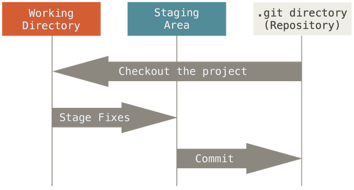

```{r setup, include=FALSE}
options(htmltools.dir.version = FALSE)
```

# What is Git?

--

- *Distributed* version control

--

- Ledger of work: 
--
snapshots

--

- Collaboration tool

--

- Workflow management software


???

- Git has been re-purposed by the data science community. In addition to using it for source code, we use it to manage the motley collection of files that make up typical data analytical projects, which often consist of data, figures, reports, and, yes, source code.

- Git is a distributed version-control system - i.e. it records the changes made to files in a repository of code as a series of snapshots stored on many servers. 

- Think of this like your standard cloud backup on steroids - not only are you able to restore your code in event of a crash, but you can also roll back your code to any of the snapshots if your code breaks. It is also easy for you to collaborate with others - again just like how you can work on the same Google Docs file with multiple people, multiple developers can simultaneously edit the same repository and record their individual changes.

---

# Why should you Care?

--

- No more emailing document revisions...
--
or final_FINALFORREAL.doc files

--

- Simpler local directory/file structures

--

- Remote storage

--

- Stable, reproducible workflows

--

- Easy add new collaborators to project

--

- The world's most boring time machine

---
name: big-point
class: inverse, center, middle
background-image: url(https://i.imgflip.com/2qqx5u.png)
background-size: contain


--

# Gitlab

---
layout: false

# What is Gitlab?

--
*gitlab.cscscience.ca*

--

- Git service provider

--

- Account management and access control

--

- Hosting platform

--

- Ticket tracker / project management tool

???

Issue tracking, collaboration, public access, pages.

Git's source control can be fairly easy to screw up in the early days of learning to 'git gud' and gitlab provides a place to grab a fresh copy whenever you need it for any reason.

---

# What to store in Github?

--
- source code (any language)

--

- markdown / Jupyter / pdf

--

- small public (images & data-sets)

## What NOT to store?

--

- PASSWORDS, access tokens, or private keys

--

- PHI, large images, large data-sets

--

- compiled binaries

--

- Non-pars-able documents (Word, Photoshop, ...)

---

# Git Vocabulary

## Working files / directory
--

- Actively editing these

--

- A directory that git is aware of


---

# Git Vocabulary

## Commit
--

- Snapshot of your working files at a particular time

--

- Creates revision history

---

# Git Vocabulary

## Staging area
--

- Files you've made changes to are saved and added to the staging area before being *committed* to the...

--

- AKA Index

---

# Git Vocabulary

## Repository
--

- Where your commit history and files are store

--

- Can be local (only on your system) or remote (on gitlab or other service)

---

# Git Vocabulary

## Add
--

- Add modified files to the staging area prior to commit

---

# Git Vocabulary

## Push
--

- Send staged commits to a repository

---

# Git Vocabulary

## Pull
--

- Send commits to a repository

---

# Git Vocabulary

## Clone 
--

- Copy a repository to your local system

---

# Git Workflow

## 
--

- Work: 
--
create, 
--
modify, 
--
or delete some files.

--

- Stage the changes with...
--
*git* **add**

--

- **Commit** often

--

- **Push**...

---

# The Layout of Git



---

# Hands on pt. 1

    - Create a new repository on Gitlab.cscscience.ca
    - Add an SSH key to that repository
      - Check if you have an SSH key on rstudio
        - Git pane
        - More > Shell
        - ```ls ~/.ssh```
      - If so, yay! If not:
        - Open a bash terminal: locally or go to jupyter.cscscience.ca 
        - Connect to the RStudio server: ```ssh rstudio```
        - Create a ssh key: ```ssh-keygen -t rsa -C "YOUR-EMAIL@canada.ca"```
        - Verify it: ```ls ~/.ssh```
        - Print your public key and copy it: ```cat ~/.ssh/id_rsa.pub``` (ctrl+insert or shift+right click in jupyter)
      - User icon > Settings > SSH Keys - Paste and save

---

# Hands on pt. 2

    - Sign in at rstudio.cscscience.ca
    - Create new project (include git repository) in RStudio
    - Make a new R Markdown file and save it as README.md
    - First commit
    - Make changes
    - Second commit
    - Add remote origin via git shell:
      - Git pane
      - More > Shell
      - git remote add origin git@gitlab.cscscience.ca:**USERNAME**/git-example.git
      

---

# What Next?
