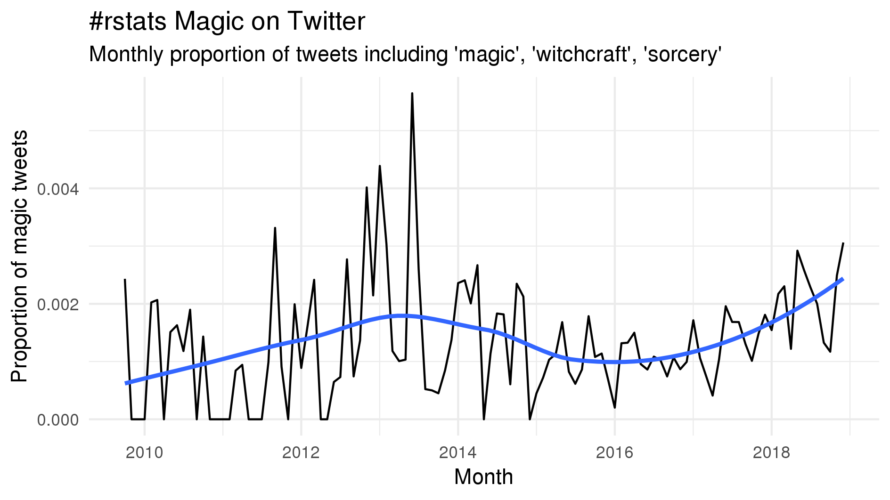
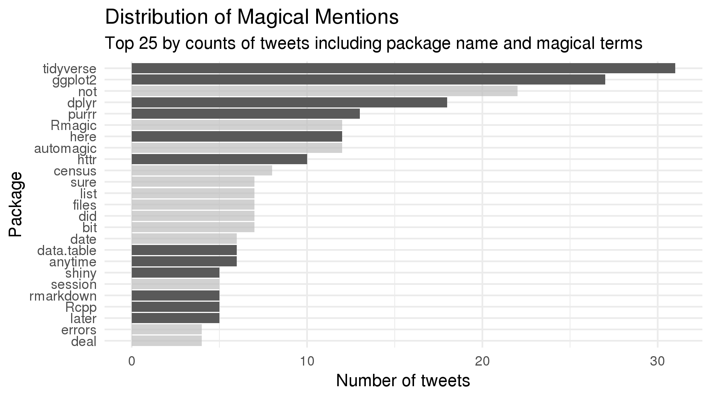

```{r setup, include=FALSE}
options(htmltools.dir.version = FALSE)
```
layout: true
class: inverse, center, middle
background-image: url("files/beast/beastcanada-40alpha.png")

---

# Taming the BEAST 2019

## August 12 - 16, 2019

## Squamish, British Columbia

---

## Talks:

Investigating the Dynamics of Diversification using Molecular Phylogenies  
\- Matthew Pennell

Bayesian Outbreak Reconstruction with Unsampled Cases and Tree Uncertainty - Caroline Colijn


Introduction to Infectious Disease Phylodynamics 
\- David Rasmussen  


Evolutionary History of HBV in the Circumpolar Arctic  
--
  \- Carla Oslowy


???

Several invited lecturers presented on studies and techniques with BEAST2

---

## Training:


##### Relaxed Phylogenetics in BEAST 2  
##### Priors with Flu A  
##### Phylogeography in BEAST 2  
##### Population Structure using the Multitype Birth-Death Model  
##### Troubleshooting BEAST 2  

---

##### Many of these tutorials were guided versions of what are available [here](https://taming-the-beast.org/tutorials/)

???


---
## And of course... As always...

---
layout: false
background-image: url(files/magic/coffee.JPG)
background-size: contain

???

Image credit: https://upload.wikimedia.org/wikipedia/commons/thumb/4/45/A_small_cup_of_coffee.JPG/1280px-A_small_cup_of_coffee.JPG

---
class: inverse, center, middle

# BEAST2?

???
Great, so you did some tutorials and watched some talks. Why should we care? What is BEAST2?

---

# BEAST
--

### A cross-platform program for Bayesian analysis of molecular sequences using MCMC.
???

So beast, the noun can be defined as:

1. any nonhuman animal, especially a large, four-footed mammal
2. a contemptible person
3. Capital T capital B: the Antichrist in Revelations
4. something formidably difficult to control or deal with
**click**
5. A cross-platform program for Bayesian analysis of molecular sequences using MCMC.


---

# BEAST2

--

A modular, extensible, cross-platform package for performing Bayesian inference using MCMC with emphasis on phylogenetic analysis of molecular sequences

--

... something formidably difficult to control or deal with


???

Bayesian Evolutionary Analysis by Sampling Trees 2:  
An independent project led by the University of Auckland that is a rewrite of the original BEAST. **click** 
"A modular, extensible, cross-platform package for performing Bayesian inference using Markov Chain Monte Carlo with emphasis on phylogenetic analysis of molecular sequences"
It estimates rooted, time-measured phylogenies using strict or relaxed molecular clock models and can be used as a method of reconstructing phylogenies but is also a framework for testing evolutionary hypotheses without conditioning on a single tree topology. 

Let me preface this with, I am not an expert in the use of BEAST or the statistics that underpin it. A week long course isn't nearly enough to get to that point... That being said:

---
layout: true
class: center, middle, inverse

# Bayesian Inference in Brief

---
layout: false

# Inference

*Premise:* If A is true, then B is true.  

--

*Premise:* A is true.  

--

*Inference:* B is true.

???

Inference is the act of deriving logical conclusions from premises assumed to be true

---
# Inference


*Premise:* All humans are mortal.  

--

*Premise:* Adrian is a human.  

--

*Inference:* Adrian is mortal.

---
# Statistical inference


*Premise:* Squamish is a popular destination for rock climbers.  

--

*Premise:* Adrian is visiting Squamish.  

--

*Statistical Inference:* Adrian is a rock climber
--
?

???
Statistical inference generalises this to situations where the
premises are not sufficient to draw conclusions without
uncertainty.

To perform statistical inference we need a theory of plausible
reasoning.

---

---

---

---

---

---

$P(model | data) = P(data | model)P(model)/P(data)$

???

Prior → P(model)
• Original probability for the model parameters/components
• Belief in our hypothesis
• All parameters have priors, whether you specify them or not!
Likelihood → P(data | model)
• Probability of data given parameters (defined by model)
Posterior → P(model | data)
• Updated probability for the model parameters in light of the data
Model evidence → P(data)
• Probability for data given model (any combination of parameters)
• Used for Bayesian model selection


---


# Software as Magic

--

* [Our colour of magic: The open sourcery of fantastic R packages](https://github.com/MilesMcBain/rstudioconf_talk)

--

* [Miles McBain](https://milesmcbain.xyz): 
--

creator of the package *datapasta*

--

* R Users publicly called it by many names:

--

 * Witchcraft
   
--
 * Dark Sorcery
   
--
 * So f*cking magical

--

* Why though?

---
class: inverse, center, middle


???

datapasta makes use of RStudio add-ins to allow users to copy and paste tabular data from the web into R data structures with a minimum of user action. My own notes from the talk include the exact quote "holy crap, use this!!!"

---
class: inverse, middle


# Regular Magic
> the power of apparently influencing the course of events by using mysterious or supernatural forces

???

Phenomena that violate the rules of our world

---
class: inverse, middle

# Regular Magic
> Phenomena that *violate our assumptions* of the rules of the world

---
class: inverse, middle

# Software Magic
> *Tools* that violate your assumptions of the rules of the *digital* world

???

Grant you the power to do more than you thought you could with your current abilities and knowledge  
His talk started with showing some web scraping and analysis of tweets referencing magical R packages

---
layout: true

# Tweets Referencing Magical Software

---
.center[

]

???

Tweets with the hashtag rstats referencing magic/witchcraft/sorcery, showing the growing proportion of all rstats tweets
---
.center[

]

???

Top 25 packages by counts of tweets as well as reference to magical abilities.
Some of those are probably included by default *cough* looking at you Rmagic, but others such as purr and dplyr have earned the magical label

---
layout: false

# Types of Magical Manifestations

--

* Zaps: 
--

    * Packages with one hero function 
--
    
    * ```tinytex::install_tinytex()```
--

    * ```here::here()```
--

* Genies:
--

    * Direct interaction with other software
--

    * Mapedit
--

* Tongues
--

    * New language to more easily express and solve a problem
--
    
    * Tidyverse


???

He went into details discussing the 3 major kinds of ways a package feels magical calling them zaps, genies, and tongues.

* Hero functions (like here())

* Interaction with leaflet maps and re-exporting that data into your R environment as useable R data structures

* Magic arises from the intuitive way verbs in this new language accomplishes what you need.

---
layout: false
class: center, middle

$$Magic =  \frac{Power}{Pain}$$
???

So the more power something grants you relative to the pain of using it the more magical it feels.

We're hoping to create sorcerers naturally, not warlocks via Faustian contracts. 

---
class: inverse, center, middle
## A Litmus Test

--
The magic of 
--
_**tool**_ 
--
is that it grants you 
--
_**power**_ 
--
while saving you from 
--
_**pain**_


???
Who here knows about dplyr? The oft-called magical data wrangler and database interface.

---
class: middle


The magic of 
--
_**dplyr**_ 
--
is that it grants you 
--
_**a vocabulary to wrangle data**_ 
--
while saving you from 
--
_**mindless typing, reading documentation, and learning SQL**_

???

What about Latex? Orin this case, the r package for installing it called tinytex

---
class: middle

The magic of 
--
_**tinytex**_ 
--
is that it grants you 
--
_**the things you need to knit PDF**_ 
--
while saving you from 
--
_**a bloated 4GB install, arcane instructions, hunting through 90s websites**_
--
:[Yihui Xie's Hall of Pain](https://yihui.name/tinytex/pain/)

---
class: inverse, center, middle
## Litmus Test

The magic of _**tool**_ is that it grants you _**power**_ while saving you from _**pain**_

---
class: center, middle
## Design Tool

The magic of _**my tool**_ is that it grants you _**power**_ while saving you from _**???**_

???

* Cram as many pain points as you can into that '???' to increase the magical nature of your tool.  
* McBain mentioned three specific pain points I'd like to run over here


---
# Saving Typing

--
* Specific to R but...

---
# Saving Typing

* Pipeable functions

--

* Autocomplete friendly names

--

* Do it for the user

???

* No more repeated typing of variable names
* Easier tab completion means faster typing
* Use Rstudio Add-ins and Templates
---

# Saving Reading

* Intuitive names

--

 * Less searching through documentation for desired functions or arguments

--

* Conform to conventions

--

 * Adhere to standard input and ouput formats where possible

--

* Be flexible

--

 * Rigid interfaces require more trial and error: 
--
more reading documentation, 
--
Stack Overflow, 
--
BioStars, 
--
etc...


???

* Users are going to want to compare the results to what they know
* Minimizing the amount of reading a user has to do to start using a new tool will increase uptake

---
# Saving Decisions

* Appropriate defaults... 

--

 * Many argue against defaults


???

* "users will blindly run the tool without changing defaults and the resulting answer will be incorrect"
* We even say this ourselves.

---
class: inverse, middle

> There is no such thing (yet) as an automated gearshift in short read mapping. It is all like stick-shift driving in San Francisco. In other words = running this tool with default parameters will probably not give you meaningful results. A way to deal with this is to understand the parameters by carefully reading the documentation and experimenting. Fortunately, Galaxy makes experimenting easy.

???

Does anyone recognize this disclaimer?

Smalt
---

# Saving Decisions

* Appropriate defaults...
--
with validation.

--

 * Why does your tool give answers that the user can't discern the validity of?

--

 * eg. Bowtie2 -X parameter:
 
--
     * Max fragment length for valid paired-end alignments

--
     * Default value: 500

--
     * Typical Miseq read length is ~300 bases 

???

Genomics core 
When your tool relies on scoring read alignments done by Bowtie2 this results in a ton of low scoring results  
without any way of knowing the results are wrong unless you have known positive samples showing up negative

---
# Saving Decisions

* Appropriate defaults...with validation.

* Why does your tool give answers that the user can't discern the validity of?

--

 * eg. BLAST -n parameter:
 
--
     * Max fragment length for valid paired-end alignments

--
     * Default value: 500

--
     * Typical Miseq read length is ~300 bases 

???

Genomics core 
When your tool relies on scoring read alignments done by Bowtie2 this results in a ton of low scoring results  
without any way of knowing the results are wrong unless you have known positive samples showing up negative

---

# Saving Decisions

* Appropriate defaults... with validation.


* Give them less

--

 * More options = more anxiety for making the right choices

--

 * Lower barrier for entry

???

* Argument against: Don't want a default here because users will blindly run the tool without changing defaults and the resulting answer will be incorrect
        - eg. Read mapping with smalt: we specifically warn users:
        > There is no such thing (yet) as an automated gearshift in short read mapping. It is all like stick-shift driving in San Francisco. In other words = running this tool with default parameters will probably not give you meaningful results. A way to deal with this is to understand the parameters by carefully reading the documentation and experimenting. Fortunately, Galaxy makes experimenting easy.
        - eg. bowtie2: -X parameter (max insert size) defaults to 500, for our Illumina reads at 250+ bp per read this invalidates all the mapped read pairs resulting in incorrect scoring. 
    - Validation is the answer to the above argument:
        - Why does your tool give answers that the user can't discern the validity of?
        - eg. with the bowtie2 -X parameter the only indication something was wrong comes from examining the pileups after the fact visually, or when a known positive sample scores as negative. A simple warning message that a vast majority of paired-end reads mapped as improperly paired would have solved this.
- UIs and Dialogues: Galaxy / IRIDA
- Give them less:
    - More options = more anxiety for making the right choices
    - Create a low barrier to entry: less to originally learn prior to running the tool for the first time


---
class: inverse, center, middle

# Encouraging a Magical Culture

---

# Encouraging a Magical Culture

--
* Learn from the users

???

Remember this?

---

class: inverse, center, middle
## Litmus Test

The magic of _**tool**_ is that it grants you _**power**_ while saving you from _**pain**_

???
Living pain of having an analysis or a need that isn't met by available software or struggling through the indescipherable tools that are available

---
# Encouraging a Magical Culture


* Learn from the users

--

 * They are directly in tune with their pain
 
--

* Often users are amateur developers

--

  * Create workarounds


???
Living pain of having an analysis or a need that isn't met by available software or struggling through the indescipherable tools that are available

---
background-image: url(files/magic/galaxy-nightmare.png)
background-size: contain

???

Eg. Mykrobe parser workflow - 300+ tool calls in Galaxy, mangled the cluster, down to one R script
---

# Encouraging a Magical Culture

* Learn from the users

 * They are directly in tune with their pain

* Often users are amateur developers

  * Create workarounds

--

* Great tools are often created by amateurs

--

 * R examples: *datapasta, ggplot, knitr*
 
--

 * The code may not be pretty but it does the job


???

- Learn from the users: they are directly in tune with user pain
- Living pain of having an analysis or a need that isn't met by available software or struggling through the indescipherable tools that are available
- These people can be amateur developers even though professional scientists and technicians
    - Often find workarounds that fufill the requirement they have but that have real drawbacks due to the way they are made
    - Eg. Mykrobe parser workflow - 300+ tool calls in Galaxy, down to one R script
- Some R examples:
    - Datapasta, ggplot, knitr were all created by students
- Encourage users to create tools to solve the problems they are facing. 
    - Then steal those ideas wholesale.

---

layout: false
class: inverse, center, middle

$$Magic =  \frac{Power}{Pain}$$

???

So the more power something grants you relative to the pain of using it the more magical it feels

---
class: inverse, center, middle

The magic of _**my tool**_ is that it grants you _**power**_ while saving you from _**???**_

---
class: inverse, center, middle

# Thanks!

Slides created with via the R package [**xaringan**](https://github.com/yihui/xaringan).

???

### Questions:
- Difference between magic and API obfuscation? 
    - Trust
    - Compelling use case helps to bolster trust
- Deep / Dark magic is often a perjorative in software development. How to expose the inner workings when the magic runs out?
    - Speculative inclusion of options may be a waste a time: don't create intricate options for users to play with when they aren't in demand.
    - Let your users guide you as they use and test the software. 
    
---
class: inverse, center, middle

# A Couple More Slides from Karl Broman

---
### Warning messages
- Make them:
    - Clear
    - Concise
    - Informative
    - Meaningful
    - Suggest a next step

---

### Tests
> "I don't need tests, I have users." - Karl Broman

--

> "If you use software that lacks automated tests, you are the tests." - Jenny Bryan

---
 
### Code inconsistencies
- Consistent naming schemes for 
    - functions
    - arguments
    - modules

---

### Documentation

Tailored Tutorials > User Guide > Examples > Formal Documentation

1. Users want to see your tool doing exactly what they want to do. 
    - Plug in data and go.
    - First importance should be showing how your users will actually use the tool
2. General user guide second
3. Examples to support the user guide for edge cases
4. No one seems to read it unless something is going wrong

---

### User support

No question is too insignificant
